<!-- ╔═══════════════════════════════════════════════════════════════════╗ -->
<!-- ║  PHANTHIVE :: ENCHANTED STATION LOG                              ║ -->
<!-- ║  "The void between stars is where fairies hide."                 ║ -->
<!-- ╚═══════════════════════════════════════════════════════════════════╝ -->

<!-- ANIMATED HEADER SVG — commit header-anim.svg to your repo root -->
<div align="center">
  <a href="https://github.com/PhantHive">
    
  </a>
</div>

<!-- TYPING SVG — neon green on transparent, matching the space-fairy palette -->
<div align="center">

[](https://git.io/typing-svg)

</div>

<!-- PROFILE BADGES ROW -->
<div align="center">

<a href="mailto:zakaria.chaouki@ipsa.fr"></a>
<br>
<a href="https://phanthive.com"></a>
<a href="https://dsc.bio/000007"></a>
<a href="mailto:zakaria.chaouki@ipsa.fr"></a>
<a href="https://github.com/PhantHive"></a>
<a href="https://maya-design.cloud"></a>


</div>

<br>

<!-- ANIMATED DIVIDER -->
<div align="center">
  
</div>

<br>

<!-- ═══════════════════════════════════════════════════════════════ -->
<!-- SECTION: ABOUT — styled as a "station log entry"             -->
<!-- ═══════════════════════════════════════════════════════════════ -->

```
┌─────────────────────────────────────────────────────────────────────────┐
│  STATION LOG — ENTRY #∞                                                 │
│  SUBJECT: PhantHive                                                     │
│  CLASS: AI Magician ✦ NLP Whisperer ✦ Game Alchemist                   │
│  STATUS: ◉ ONLINE · 💼 OPEN TO WORK                                     │
└─────────────────────────────────────────────────────────────────────────┘
```

<div align="center">
  <table>
    <tr>
      <td width="50%" valign="top">

<br>

> *Eyyo adventurers, recruiters, friends and welcome to my realm.*
>
> I am **PhantHive**, my real name is Zakaria Chaouki.
> 
> I am a 25 years old graduated engineer in AeroSpace Engineering. I have a specialization in Artificial Intelligence.
> While I have a strong background in aerospace, my strongest passion lies in software development and NLP.
> 
> I am currently looking for a junior position in software development, AI research or NLP engineering. I am open to remote or on-site opportunities.
> I love to contribute to tools that help people and make their lives easier, and I am always eager to learn new technologies and improve my skills.

```yaml
# ─── identity.yml ───
name: "PhantHive"
class: "AI Magician"
guild: "Phearion"
origin: "The Mythical Realm"
pronouns: "he/him"
languages:
  fluent: [Python, TypeScript, JavaScript]
  learning: [Rust, Assembly, C, C++, C#]
interests:
  - "🔮 Artificial Intelligence"
  - "🧚 Discord Bots & Activities"
  - "🌿 Natural Language Processing"
  - "🎮 Game Dev (Unity C#)"
  - "?? Software Development"
  - "?? Web Technologies (React, Node.js)"
```

  </td>
  <td width="50%" valign="top">

<br>

```
          ✧
     ·  ✦  ·           ╭──── CURRENT QUEST ────╮
   ✧  ·  ·  ✧          │                        │
  · 🧚 ·  ·  ·         │  Casting strong spells │
   ✧  ·  ·  ✧          │  AI, Games & Bots at   │
     ·  ✦  ·            │  ✦ Phearion ✦         │
          ✧             │                        │
                        ╰────────────────────────╯
  ╭─────────────────╮
  │  GUILD RANK     │   ✦ Co-founder of SCRYPT
  │  ████████░░ 80% │     AI & Robotics Guild
  │  THE ELDER      │
  ╰─────────────────╯   ✦ Harvesting wisdom in
                          the arcane arts of NLP
  ╭─────────────────╮
  │  MANA RESERVES  │   ✦ Can refactor spells
  │  ██████████ 200%│     faster than a dragon's
  │  OVERFLOWING    │     midnight flight ⚡
  ╰─────────────────╯
```

  </td>
  </tr>
  </table>
</div>

<br>

<!-- ANIMATED DIVIDER -->
<div align="center">
  
</div>

<br>

<!-- ═══════════════════════════════════════════════════════════════ -->
<!-- SECTION: TECH STACK — Futuristic badges with neon palette    -->
<!-- ═══════════════════════════════════════════════════════════════ -->

<div align="center">
  <h3>⟨ ARCANE TECH ARSENAL ⟩</h3>
  <sub>◈ Systems operational · All runes charged ◈</sub>

<br><br>

  <!-- Core Languages -->
  
  
  

  <br>

  <!-- Frameworks & Runtime -->
  
  
  

  <br>

  <!-- AI/ML -->
  
  
  

  <!-- DevOps & Tools -->
  
  
  
  

</div>

<br>

<!-- ANIMATED DIVIDER -->
<div align="center">
  
</div>

<br>

<!-- ═══════════════════════════════════════════════════════════════ -->
<!-- SECTION: PROJECTS — Collapsible enchanted grimoire            -->
<!-- ═══════════════════════════════════════════════════════════════ -->

<div align="center">
  <h3>⟨ ENCHANTER'S GRIMOIRE ⟩</h3>
  <sub>◈ Active research & spell archives ◈</sub>
</div>

<br>

<!-- PROJECT 1: MYTHICAL -->
<details>
<summary> <b>🥚 Mythical</b> — <i>A creature-hatching RPG across 500+ Discord realms</i> &nbsp;  🔒</summary>

<br>

| Aspect | Details |
|:-------|:--------|
| **Platform** | Discord Bot |
| **Command** | `/myth` |
| **Servers** | 300+ active realms |
| **Status** | 🔵 BETA PHASE |

**Features:**
- 🥚 Creature Hatching & Evolution
- 🏠 Housing Customization System
- ⚔️ TCG Battle System
- 🔮 Creature Fusion Mechanics
- ✨ XP Boost & Reward Systems

| Link | Description |
|:-----|:------------|
| 🔒 Private Repository | Source code (Private) |
| [🌐 Website](https://mythical.phearion.fr) | Official website |
| [📊 Top.gg](https://top.gg/bot/1250496056521654393) | Bot listing & reviews |

</details>

<!-- PROJECT 2: BIG BRAIN -->
<details>
<summary> <b>🧠 Big Brain</b> — <i>An AI familiar for academic research & knowledge</i> &nbsp;  </summary>

<br>

| Aspect | Details |
|:-------|:--------|
| **Type** | AI Research Assistant |
| **Tech Stack** | Python, TensorFlow, PyTorch, HuggingFace 🤗 |
| **Purpose** | Academic research & knowledge exploration |
| **Status** | ⏸️ Paused |

| Link | Description |
|:-----|:------------|
| 🔒 Private Repository | Frontend & Backend (Private) |

</details>

<!-- PROJECT 3: DISCORD BOTS -->
<details>
<summary> <b>🧚 Discord Bots & Assistants</b> — <i>Magical companions for Discord servers</i> </summary>

<br>

| Bot | Purpose | Status | Links |
|:-------|:---------|:---------|:--------|
| **🧚 Lucky** | Engineering student assistant | ✅ Active | [GitHub](https://github.com/PhantHive/ania-bot) · [Web](https://lucky.phearion.fr) |
| **🎲 Lumina** | Mystical duel game (Discord Activity) | 🔮 In development | Coming soon |

</details>

<!-- PROJECT 3B: ZUMI MUSIC PLAYER -->
<details>
<summary> <b>🪩 Zumi</b> — <i>A beautiful music player app with E.T.H.I.C.A.L music library</i> 🔒</summary>

<br>

| Aspect | Details |
|:-------|:--------|
| **Type** | Music Player Application |
| **Features** | Kawaii interface, Curated music library (E.T.H.I.C.A.L) |
| **Status** | ✅ Active |
| **Repository** | 🔒 Private Repository |

</details>

<!-- PROJECT 4: INLP -->
<details>
<summary> <b>🍃 INLP (IRIS Natural Language Processing)</b> — <i>Homegrown NLP enchantments</i> </summary>

<br>

> *"Why use mundane libraries when you can brew your own potions?"*

A custom NLP toolkit built from scratch — because the best spells are the ones you craft yourself.

| Link | Description |
|:-----|:------------|
| [🔗 GitHub](https://github.com/PhantHive/inlp) | Source repository |

</details>

<br>

<!-- ANIMATED DIVIDER -->
<div align="center">
  
</div>

<br>

<!-- ═══════════════════════════════════════════════════════════════ -->
<!-- SECTION: GITHUB STATS — dark themed to match space palette   -->
<!-- ═══════════════════════════════════════════════════════════════ -->

<div align="center">
  <h3>⟨ SYSTEM DIAGNOSTICS ⟩</h3>
  <sub>◈ Real-time enchantment metrics ◈</sub>

<br><br>

  <!-- Stats with picture element for dark/light mode support -->
  <picture>
    <source media="(prefers-color-scheme: dark)" srcset="https://github-readme-stats.vercel.app/api?username=PhantHive&show_icons=true&theme=midnight-purple&bg_color=0a0015&title_color=00ffb3&icon_color=7b68ee&text_color=aaaacc&border_color=1a1a3e&hide_border=false&ring_color=ff69b4">
    
  </picture>
  <picture>
    <source media="(prefers-color-scheme: dark)" srcset="https://github-readme-streak-stats.herokuapp.com?user=PhantHive&theme=midnight-purple&background=0a0015&ring=ff69b4&fire=ff69b4&currStreakLabel=00ffb3&sideLabels=7b68ee&currStreakNum=00ffb3&sideNums=aaaacc&dates=4a4a6a&border=1a1a3e">
    
  </picture>

<br><br>

  <picture>
    <source media="(prefers-color-scheme: dark)" srcset="https://github-readme-stats.vercel.app/api/top-langs/?username=PhantHive&layout=compact&theme=midnight-purple&bg_color=0a0015&title_color=00ffb3&text_color=aaaacc&border_color=1a1a3e&hide_border=false">
    
  </picture>

</div>

<br>

<!-- ANIMATED DIVIDER -->
<div align="center">
  
</div>

<br>

<!-- ═══════════════════════════════════════════════════════════════ -->
<!-- SECTION: CURRENTLY PLAYING / ACTIVITY                        -->
<!-- ═══════════════════════════════════════════════════════════════ -->

<div align="center">
  <h3>⟨ STATION ACTIVITY ⟩</h3>

  <br>

  <a href="https://dsc.bio/000007">
    
  </a>
  &nbsp;&nbsp;
  <a href="https://top.gg/bot/1250496056521654393">
    
  </a>

</div>

<br>

<!-- ANIMATED DIVIDER -->
<div align="center">
  
</div>

<br>

<!-- ═══════════════════════════════════════════════════════════════ -->
<!-- SECTION: SUPPORT / CHARITY                                   -->
<!-- ═══════════════════════════════════════════════════════════════ -->

<div align="center">
  <h3>⟨ WEAVE REAL-WORLD MAGIC ⟩</h3>
  <sub>◈ The most powerful spells help others ◈</sub>

<br><br>

<a href="https://fr.wfp.org"></a>
&nbsp;
<a href="https://onetreeplanted.org/products/asia?variant=3856550428701"></a>

<br><br>

> *"In a world of digital spells and enchantments, remember that the most*
> *powerful magic lies in helping others. Every small act of kindness ripples*
> *through the universe like stardust, creating constellations of hope."* ✨

</div>

<br>

<!-- ANIMATED DIVIDER -->
<div align="center">
  
</div>

<br>

<!-- ═══════════════════════════════════════════════════════════════ -->
<!-- FOOTER — Space station sign-off                               -->
<!-- ═══════════════════════════════════════════════════════════════ -->

<div align="center">

```
  .  ✧  .  .  ✦  .  .  ✧  .  .  ✦  .  .  ✧  .  .  ✦  .  .  ✧  .
  
           ╔═══════════════════════════════════════╗
           ║                                       ║
           ║   ⟨ END OF TRANSMISSION ⟩             ║
           ║                                       ║
           ║   PhantHive · Orbiting Jupyter        ║
           ║   "The void whispers back if you      ║
           ║    listen with fairy ears." 🧚        ║
           ║                                       ║
           ╚═══════════════════════════════════════╝
  
  .  ✧  .  .  ✦  .  .  ✧  .  .  ✦  .  .  ✧  .  .  ✦  .  .  ✧  .
```

<sub>

*"The tragedy is a symphony, and the Man is the Virtuoso."* — ApoCs, 2017

</sub>

</div>

<!-- FOOTER WAVE via capsule-render -->
